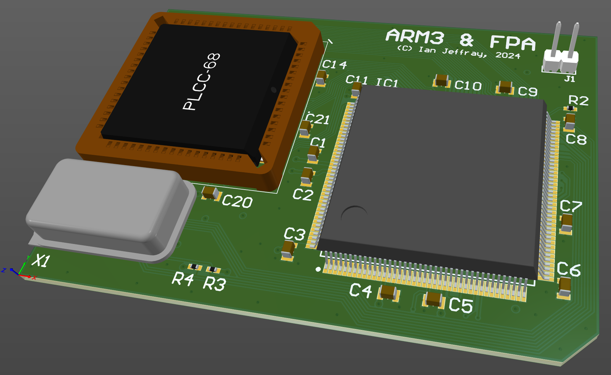

# Acorn Archimedes ARM3 processor card, with FPA.

January 2024

This is my implementation of an ARM3 upgrade card with FPA that will plug in to the ARM2 socket on early model Acorn Archimedes machines.

The non-FPA version has been tested successfully over a dozen builds using 25MHz and 33MHz parts recovered from dead A5000 machines, and my A540 ARM3 FPA card has been successfully tested in several systems, so this project simply brings those two projects together.

Multiple options are provided for clock source - standard oscillator, SMT oscillator and ICD2053 clock generator.

This design has not yet been built or tested.

## Licence

No warranty is provided, and this work is used at your own risk.  

Licenced as CC BY-SA 4.0

Copyright 2024 Ian Jeffray

